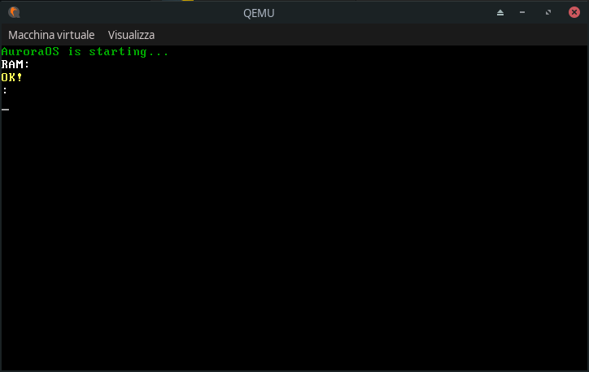

# Aurora
Aurora is an Open-Source Operating System developed by me with goal: develop a free, open source operating system (not just a kernel) that uses few resources and is the most fool proof possible.

Below there are screenshots that represent how it works:


## Compile Prerequisites
The prerequisites for compiling Aurora are:
  - Linux OS (Alternatively a WLS distribution can be used)
  - GAS assembler
  - GCC
  - Xorriso
  - Grub-mkrescue
  - Qemu

If you do not have the necessary prerequisites you can install them using the following command:
```bash
make install_<YOUR_PACKAGE_MANAGER>
```
<b>At the moment it only works with apt and pacman</b>

## Build
To start the build of Aurora just type in the terminal the following command:
```bash
make
```
or
```bash
make build
```

## Clean
To start the clean of Aurora just type in the terminal the following command:
```bash
make clean
```

## System Prerequisites
- CPU: 32/64bit 1 core processor
- RAM: 1mb (Minimum) or 64mb (Recommended)

